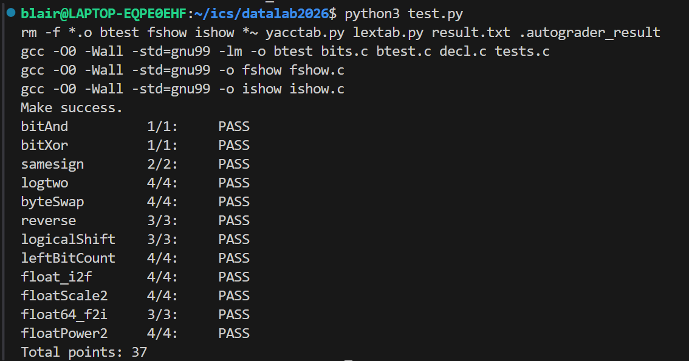

# Data Lab 实验报告

姓名：宝乐儿

学号：2025201684

| 函数 | 得分 | 函数 | 得分 |
| --- | ---: | --- | ---: |
| `bitAnd` | 1 | `bitXor` | 1 |
| `samesign` | 2 | `logtwo` | 4 |
| `byteSwap` | 4 | `reverse` | 3 |
| `logicalShift` | 3 | `leftBitCount` | 4 |
| `float_i2f` | 4 | `floatScale2` | 4 |
| `float64_f2i` | 3 | `floatPower2` | 4 |
| **总分** | **37/37** |  |  |

测试截图：

## 解题报告

### 亮点

1. `float_i2f` 直接用E计数，减少了很多操作数，而且直接对最终需要返回的结果中的阶码部分进行更改。
2. `float64_f2i` 明确拆分符号位、阶码和 53 位有效数，清晰地按层次分类（位移位数）讨论。

### 整数位运算题

#### `bitAnd` 与 `bitXor`

`bitAnd` 直接使用德摩根律：`x & y = ~(~x | ~y)`。

`bitXor` 先构造 `x | y`，再与 `~(x & y)` 做与运算，得到
`~(~x & ~y) & ~(x & y)`。这样才能只使用题目允许的 `~` 和 `&`。

#### `samesign`

根据要求，0没有正负，因此先单独处理。两个数均非零时，比较 `x >> 31` 与 `y >> 31` 的符号位；符号位相同返回 1，否则返回 0。

#### `logtwo`

目标是最高位 1 的下标。先判断输入是否大于 `0xFFFF`，若是则答案至少增加 16，并右移 16 位；之后依次用 8、4、2、1 位继续判断。最后将各段得到的增量按位或，结果就是 `floor(log2(v))`。

#### `byteSwap`

先将 `n`、`m` 分别乘 8 得到移位量，用右移和 `& 0xFF` 取出两个字节，再构造对应掩码清除原位置，最后把两个字节移到对方位置。若 `n == m`，清除后又放回同一字节，结果自然不变。

#### `reverse`

跟一般的程序设计有异曲同工之处，循环 32 次：每次取出当前最低位，追加到结果最低位，再将输入右移一位、结果左移一位。这样输入的位从低到高依次被写入结果的高到低位置。

#### `logicalShift`

先进行普通右移，再用掩码清除算术右移补出的符号位。有效掩码包含 `32-n` 个低位 1；当 `n=0` 时，`32-n` 为 32，不可以进行移动操作，所以通过 `& 0x1F` 避免实际执行32位移位，并用 `!n` 恢复全 1 掩码，覆盖这个边界情况。

#### `leftBitCount`

采用与二分查找类似的分段方法，依次检查最高端的 16、8、4、2、1 位是否全为 1。若某一段全为 1，就把计数增加相应长度，并左移输入把下一段移到最高位继续检查。`x == -1` 时前31位检查后还需再加 1，因此用 `!~x` 单独处理全 1 情况。

### 浮点数位级操作题

#### `float_i2f`

目标返回值按单精度浮点数的位布局组装：最高位是符号位，中间 8 位是阶码，低 23 位是尾数。对非零整数先取无符号绝对值，寻找最高位 1 并通过左移进行规格化；初始阶码为 158，每左移一位减 1。截断尾数时检查被丢弃部分：大于舍入标准时时进位，恰好到舍入标准时采用“舍入到偶数”。最后补上：进位导致规格化数溢出时同步增加阶码。

#### `floatScale2`

拆出符号、阶码和尾数。阶码全1直接返回原值；阶码为 0 时将尾数左移一位，处理非规格化数；其他情况只将阶码加 1。最后重新拼接三部分。

#### `float64_f2i`

先取符号位和 11 位阶码，令 `real_e = E - 1023`；规格化数的有效数为 `N = M_high * 2^32 + M_low`，实际整数值为 `N * 2^(real_e-52)`。

- `real_e < 0`、非规格化数或零返回 0；`E == 0x7FF` 或 `real_e > 30` 返回溢出标记 `0x80000000`。
- `real_e < 20` 时，低 32 位全部被右移丢弃，只需右移 `M_high`。
- `real_e == 20` 时，结果正好是 `M_high`。
- `real_e > 20` 时，将 `M_high` 左移并拼接 `M_low` 的高位。

最后若符号位为 1，使用 `~res + 1` 转为二进制补码负数。

#### `floatPower2`

根据 `2^x` 的范围选择表示形式：`x > 127` 时返回正无穷；`x < -149` 时下溢为 0；`-149 <= x <= -127` 时构造非规格化数，在尾数的第 `x+149` 位放置 1；`x > -127` 时使用规格化表示，阶码为 `x+127`。

## 反馈与收获

我大概用了三天的课余时间抽空完成本项任务。本实验让我把补码、移位、掩码和 IEEE 754 位布局联系起来。最容易出错的是符号扩展、`n=0` 的移位边界、以及阶码临界值；最主要是学到了用位运算解决数字问题的大概路径是先确定已知的七点和需要到达的终点，再想办法从中间搭桥连通。

## 参考资料

- 课内ppt
